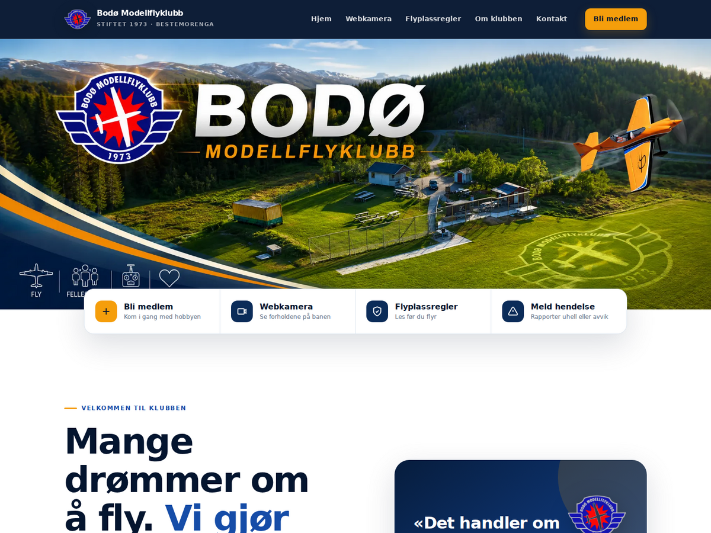

# Bodø Modellflyklubb – WordPress

Åpen kildekode for [bodomfk.no](https://bodomfk.no/). Repositoryet inneholder det selvstendige WordPress-temaet som driver klubbens offentlige nettsted.

## Temaet

`themes/bodomfk-modern-theme/` er et responsivt tema uten avhengighet til GeneratePress, GP Premium, SiteOrigin eller en sidebygger. Temaet inkluderer blant annet:

- hovedbanner, moderne forside og mobilmeny;
- fremhevet valg mellom klubbens to Facebook-grupper;
- snarveier til innmelding, webkamera, regler og hendelsesrapportering;
- Windy-webkamera og Yrs værkort for Bestemorenga på forsiden;
- Light/Dark-visning styrt av WP Dark Mode, med egne kontrastsikre kortfarger;
- beskyttede kontaktadresser for generelle henvendelser og faktura;
- avtalen med Bodø kontrolltårn om klubbaktiviteten ved Bestemorenga;
- metadata for søkemotorer og deling i sosiale medier;
- Git-versjonerte sidetekster for Medlemsfordeler, Klubbhytta, Kontakt oss og Flyplassregler;
- redigerbare lenker og åpningstider under **Utseende → Tilpass → Klubbinformasjon**.

Versjon 1.4.0 faser ut den tidligere migreringsutvidelsen. Nettsiden er ferdig migrert, og temaet trenger ikke et separat migreringsverktøy i normal drift.

## Last ned og installer

Den enkleste metoden er å åpne [Releases](https://github.com/5olvik/bodomfk-wordpress/releases), velge nyeste versjon og laste ned `bodomfk-modern-theme-1.5.3.zip` under **Assets**. Dette er den ferdige tema-ZIP-en; ikke bruk GitHubs «Source code»-filer som WordPress-tema.

I WordPress går du til **Utseende → Temaer → Legg til nytt tema → Last opp tema**, velger ZIP-filen og godtar å erstatte den installerte versjonen. Se [installasjonsveiledningen](docs/INSTALLASJON.md) for kontrollpunkter.

Hver endring på `main` som berører temaet blir kontrollert og pakket automatisk av GitHub Actions. Versjonsnummeret i `style.css` bestemmer navnet på utgivelsen.

## Endre sidetekster

De fire faste informasjonssidene ligger under [`themes/bodomfk-modern-theme/content/pages/`](themes/bodomfk-modern-theme/content/pages/). De kan redigeres direkte på GitHub og sendes inn som pull request. Se [veiledningen for Git-versjonert innhold](docs/INNHOLD-I-GITHUB.md) før du endrer struktur, lenker eller spesialmarkører.

## Krav

- WordPress 6.4 eller nyere
- PHP 7.4 eller nyere
- WP Dark Mode for besøksstyrt Light/Dark-visning
- Email Address Encoder for ekstra beskyttelse av e-postadresser

Temaet har ingen byggeprosess og bruker vanlig PHP, HTML, CSS og JavaScript.

## Sikkerhet og personvern

Repositoryet skal aldri inneholde:

- `wp-config.php`, `.env`, passord eller tilgangsnøkler;
- database-, SQL- eller WordPress XML-eksporter;
- Duplicator-/backupfiler eller `installer.php`;
- medlemslister, brukerkontoer eller private personopplysninger;
- opplastinger som ikke er godkjent for offentlig bruk.

Se [SECURITY.md](SECURITY.md) dersom du oppdager en sikkerhetsfeil eller sensitiv informasjon.

## Bidra

Forslag, feilrettinger og designforbedringer er velkomne. Les [CONTRIBUTING.md](CONTRIBUTING.md), opprett gjerne en issue og send endringen som en pull request.

## Lisens

Koden distribueres under [GNU General Public License v2.0](LICENSE). Bilder og klubbmerker tilhører Bodø Modellflyklubb og skal ikke brukes som om de representerer andre organisasjoner.
