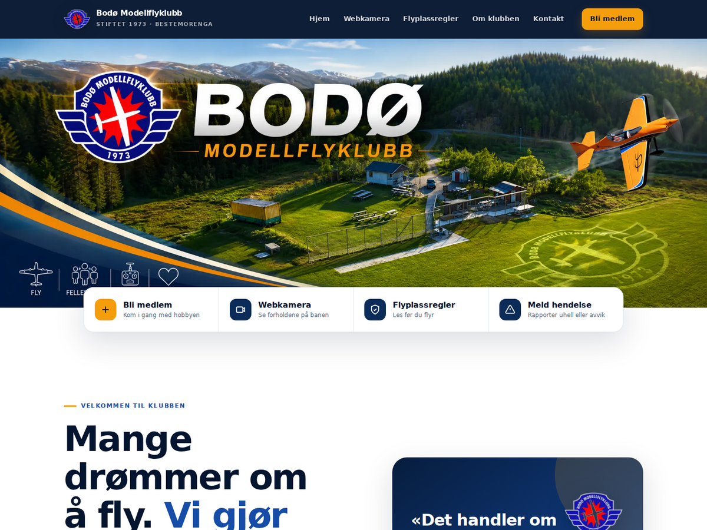

# Bodø Modellflyklubb – WordPress

Åpen kildekode for [bodomfk.no](https://bodomfk.no/). Repositoryet inneholder det selvstendige WordPress-temaet som driver klubbens offentlige nettsted.

## Temaet

`themes/bodomfk-modern-theme/` er et responsivt tema uten avhengighet til GeneratePress, GP Premium, SiteOrigin eller en sidebygger. Temaet inkluderer blant annet:

- hovedbanner, moderne forside og mobilmeny;
- fremhevet valg mellom klubbens to Facebook-grupper;
- snarveier til ny-medlem-guiden, webkamera, appveiledning, regler og hendelsesrapportering;
- klubbens eget, WordPress-leverte webkamera og værstasjon fra Bestemorenga på forsiden;
- Light/Dark-visning styrt av WP Dark Mode, med egne kontrastsikre kortfarger;
- beskyttede kontaktadresser for generelle henvendelser og faktura;
- én delt passordtilgang til avtalen med Bodø kontrolltårn og de historiske flyplassreglene fra 2018;
- tydelig veiledning om NLFs sikkerhetssystem, åpen kategori og femkilometersonen ved Bestemorenga;
- presis informasjon om barn og ungdom, 16-årshovedregelen i åpen kategori og selvstendig klubbflyging etter A-bevis;
- et komplett, Git-versjonert lokalt regelverk for flyplassen med en kortversjon for nye medlemmer;
- metadata for søkemotorer og deling i sosiale medier;
- ferdige BMFK-ikoner for Apple-hjemskjerm og SuperPWA;
- kompatibilitetsregler som holder SuperPWA-manifestet, service workeren og det levende webkamerabildet stabile på webhotellet;
- en Git-versjonert installasjonsveiledning for BMFK-appen på iPhone, iPad, Android og Chrome;
- Git-versjonerte sidetekster for Nytt medlem, Medlemsfordeler, Klubbhytta, Kontakt oss og Flyplassregler;
- en Git-versjonert personvernerklæring med informasjon om webkamera, værmodul, sikkerhetslogger, e-post, medlemsdata og registrertes rettigheter;
- redigerbare lenker og åpningstider under **Utseende → Tilpass → Klubbinformasjon**.

Versjon 1.4.0 faser ut den tidligere migreringsutvidelsen. Nettsiden er ferdig migrert, og temaet trenger ikke et separat migreringsverktøy i normal drift.

## Last ned og installer

Den enkleste metoden er å åpne [Releases](https://github.com/5olvik/bodomfk-wordpress/releases), velge nyeste versjon og laste ned `bodomfk-modern-theme-1.6.18.zip` under **Assets**. Dette er den ferdige tema-ZIP-en; ikke bruk GitHubs «Source code»-filer som WordPress-tema.

I WordPress går du til **Utseende → Temaer → Legg til nytt tema → Last opp tema**, velger ZIP-filen og godtar å erstatte den installerte versjonen. Se [installasjonsveiledningen](docs/INSTALLASJON.md) for kontrollpunkter.

Se [PWA-oppsettet](docs/PWA.md) for ikonvalg, kontrollpunkter og cachehensyn for SuperPWA.

Se [dokumenttilgang](docs/DOKUMENTTILGANG.md) for hvordan det delte passordet til Avinor-avtalen og 2018-dokumentet settes og testes.

Se [`assets/config/README.txt`](themes/bodomfk-modern-theme/assets/config/README.txt) for manuell installasjon av webkameraets behandlingsscript og `.htaccess` i `/webcam/` på webhotellet. Filene følger tema-ZIP-en som dokumenterte maler, men aktiveres ikke automatisk av WordPress.

Hver endring på `main` som berører temaet blir kontrollert og pakket automatisk av GitHub Actions. Versjonsnummeret i `style.css` bestemmer navnet på utgivelsen.

## Endre sidetekster

De sju faste informasjonssidene ligger under [`themes/bodomfk-modern-theme/content/pages/`](themes/bodomfk-modern-theme/content/pages/). De kan redigeres direkte på GitHub og sendes inn som pull request. Se [veiledningen for Git-versjonert innhold](docs/INNHOLD-I-GITHUB.md) før du endrer struktur, lenker eller spesialmarkører.

## Krav og aktive utvidelser

- WordPress 6.4 eller nyere
- PHP 7.4 eller nyere

For hele oppsettet som brukes på bodomfk.no skal disse utvidelsene være aktive:

- **WP Dark Mode** – besøksstyrt Light/Dark-visning.
- **Email Address Encoder** – ekstra beskyttelse av e-postadressene.
- **SuperPWA** – installasjon som app og grunnleggende frakoblet støtte.
- **Complianz GDPR/CCPA Cookie Consent** – cookie-skanning, samtykke og erklæring om informasjonskapsler.
- **Really Simple Security** – sikkerhetsherding, innloggingsbeskyttelse og tofaktor for administratorer.

Ingen av utvidelsene over er en skjult teknisk avhengighet som får selve temaet til å krasje dersom den mangler, men den tilhørende funksjonen og det avtalte driftsoppsettet blir da ufullstendig. [Utvidelsesplanen](docs/UTVIDELSESPLAN.md) forklarer også hvilke hjelpeutvidelser som er valgfrie eller kan fjernes.

Temaet har ingen byggeprosess og bruker vanlig PHP, HTML, CSS og JavaScript.

## Sikkerhet og personvern

Repositoryet skal aldri inneholde:

- `wp-config.php`, `.env`, passord eller tilgangsnøkler;
- database-, SQL- eller WordPress XML-eksporter;
- Duplicator-/backupfiler eller `installer.php`;
- medlemslister, brukerkontoer eller private personopplysninger;
- opplastinger som ikke er godkjent for offentlig bruk.

Se [SECURITY.md](SECURITY.md) dersom du oppdager en sikkerhetsfeil eller sensitiv informasjon.

## Bidra

Forslag, feilrettinger og designforbedringer er velkomne. Les [CONTRIBUTING.md](CONTRIBUTING.md), opprett gjerne en issue og send endringen som en pull request.

## Lisens

Koden distribueres under [GNU General Public License v2.0](LICENSE). Bilder og klubbmerker tilhører Bodø Modellflyklubb og skal ikke brukes som om de representerer andre organisasjoner.
